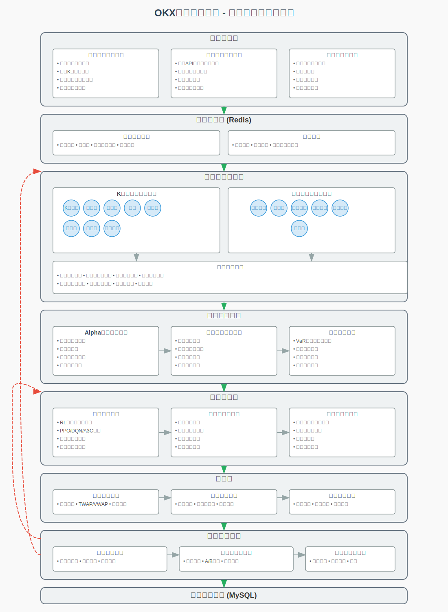

# OKX量化交易系统 - 大模型多智能体架构

基于Node.js的OKX量化交易系统，将大语言模型与量化策略深度结合，通过多智能体协同工作实现自动化交易决策。

## 系统概述

本系统采用多智能体架构，将量化交易的各个方面分解为专门的智能体组件，由大语言模型协调和优化。系统支持多种K线分析智能体和市场环境智能体，通过配置文件可灵活启用或禁用不同组件。

## 核心特点

- **多智能体协同**: 多个专业智能体从不同角度分析市场，提供全面的决策支持
- **K线模式分析**: 8种专业K线分析智能体，覆盖形态识别、蜡烛图模式、周期性分析等
- **市场环境分析**: 6种市场环境智能体，包括实时行情、情绪分析、趋势捕捉等
- **强化学习优化**: 通过强化学习自动调整各智能体权重和策略参数
- **灵活配置**: 通过JSON配置文件自定义智能体组合和参数
- **风险管理**: 内置完善的风险控制机制和资金管理策略
- **反馈循环**: 系统持续从交易结果中学习并自我优化

## 系统架构

系统由以下核心模块组成：

1. **数据获取层**: 从OKX API获取市场数据和其他外部数据源
2. **数据缓存层**: 使用Redis存储热数据，提高数据访问速度
3. **多智能体分析层**: 由多个专业智能体组成，分析市场的不同方面
4. **策略生成引擎**: 基于智能体分析结果生成交易策略
5. **决策优化层**: 使用强化学习优化决策过程
6. **执行层**: 通过OKX API执行交易
7. **反馈与优化层**: 评估系统表现并持续优化
8. **持久化存储层**: 使用MySQL存储历史数据、交易记录和系统配置

### 系统功能架构图

以下是完整的系统功能架构图，展示了各模块之间的关系和数据流：



**架构图说明**:
- 绿色虚线箭头表示主要数据流
- 红色虚线箭头表示反馈和控制流
- 蓝色圆圈代表各类智能体
- 不同颜色的层级代表系统的不同功能模块

架构图直观展示了数据如何从获取到分析、决策和执行的完整流程，以及系统如何通过反馈循环实现自我优化。特别突出了多智能体协同工作模式以及Redis缓存层和MySQL持久化存储的应用。

详细架构和流程图请参考 [system-prototype.md](system-prototype.md) 和 [system-flowchart.md](system-flowchart.md)。

## 模块化开发步骤

系统采用模块化开发方法，按照以下步骤实现：

### 1. 项目初始化与基础设施搭建

#### 1.1 环境配置

- **开发环境搭建**
  - 安装Node.js运行时和npm包管理器
  - 配置ESLint和Prettier代码规范工具
  - 设置TypeScript编译环境
- **项目结构设计**
  - 创建模块化目录结构
  - 设置配置文件存放位置
  - 建立日志和文档目录
- **构建工具配置**
  - 配置Webpack打包流程
  - 设置Babel转译选项
  - 建立开发和生产环境区分
- **版本控制与CI/CD**
  - 初始化Git仓库
  - 配置GitHub Actions工作流
  - 设置自动化测试和部署流程

#### 1.2 依赖管理

- **核心依赖集成**
  - 安装OKX API SDK
  - 安装google API SDK
  - 集成TensorFlow.js/ml5.js库
  - 引入数据处理和分析库
  - 配置日志管理工具(winston)
  - 集成时区处理工具(moment-timezone)
  - 引入数据验证工具(joi)

- **大模型API接口**
  - 配置Google Gemini API连接
  - 配置OpenAI API连接
  - 配置讯飞星火API连接
  - 配置百度文心一言API连接
  - 配置字节火山引擎API连接
  - 配置Kimi API连接
  - 开发统一的大模型接口抽象层
  - 实现多模型切换机制
  - 开发模型性能监控系统

- **数据存储配置**
  - 设置Redis连接池和缓存策略
  - 配置MySQL数据库连接和连接池
  - 开发ORM映射层
  - 实现数据验证和类型转换
  - 配置数据库连接重试机制
  - 开发数据备份和恢复策略

- **工具库集成**
  - 引入HTTP请求库(axios)
  - 集成工具函数库(lodash)
  - 配置开发工具(nodemon)
  - 集成测试框架(jest)
  - 配置代码规范工具(eslint, prettier)

#### 1.3 核心配置系统

- **配置加载机制**
  - 实现分层配置文件架构
  - 开发环境变量处理
  - 创建配置验证机制
- **智能体配置结构**
  - 设计智能体配置模式
  - 实现配置文件解析器
  - 创建默认配置模板
- **参数验证逻辑**
  - 开发配置校验器
  - 实现参数约束检查
  - 设计错误处理机制
- **热更新配置**
  - 监控配置文件变化
  - 实现配置动态重载
  - 开发配置变更通知系统

### 2. 数据层开发

#### 2.1 市场数据采集模块

- **OKX API封装**
  - 封装REST API请求
  - 实现WebSocket实时数据连接
  - 开发API错误处理和重试机制
- **市场数据获取**
  - 实现K线数据采集
  - 开发订单簿数据获取
  - 创建成交记录采集
- **资金费率和深度数据**
  - 实现资金费率数据获取
  - 开发市场深度数据采集
  - 创建合约信息获取
- **数据流管理**
  - 设计数据流管道
  - 开发数据订阅机制
  - 实现数据分发系统

#### 2.2 外部数据采集模块

- **新闻API集成**
  - 对接财经新闻API
  - 实现关键词过滤
  - 开发新闻情感分析
- **社交媒体数据**
  - 连接Twitter/Reddit API
  - 实现社交媒体监控
  - 开发趋势话题分析
- **宏观经济数据**
  - 集成经济指标API
  - 开发数据同步机制
  - 创建指标相关性分析
- **链上数据采集**
  - 连接区块链节点
  - 实现交易监控
  - 开发链上指标计算

#### 2.3 数据预处理模块

- **数据清洗**
  - 实现异常值检测
  - 开发数据规范化
  - 创建时间序列对齐
- **缺失值处理**
  - 实现缺失值检测
  - 开发插值算法
  - 创建数据完整性检查
- **技术指标计算**
  - 实现常用技术指标库
  - 开发自定义指标框架
  - 创建指标可视化工具
- **特征工程**
  - 实现特征提取管道
  - 开发特征选择算法
  - 创建特征重要性评估

#### 2.4 数据缓存层

- **缓存策略设计**
  - 定义缓存数据结构
  - 设计TTL策略
  - 创建缓存预热机制
- **实时行情缓存**
  - 实现价格数据缓存
  - 开发订单簿缓存
  - 创建高频数据缓存优化
- **热点数据管理**
  - 识别热点访问模式
  - 实现LRU缓存机制
  - 开发缓存命中率监控
- **缓存更新机制**
  - 实现增量更新策略
  - 开发原子性更新操作
  - 创建发布/订阅更新通知

#### 2.5 数据持久化层

- **数据库模式设计**
  - 设计关系模型
  - 创建表结构和索引
  - 开发数据分区策略
- **ORM层实现**
  - 开发实体映射
  - 实现查询构建器
  - 创建事务管理
- **数据分区与索引**
  - 实现时间序列分区
  - 开发复合索引策略
  - 创建查询优化器
- **查询接口开发**
  - 实现CRUD操作封装
  - 开发批量操作接口
  - 创建高级查询功能

### 3. 智能体开发

#### 3.1 智能体基础架构

- **接口与基类**
  - 设计Agent通用接口
  - 实现BaseAgent抽象类
  - 创建智能体生命周期管理
- **注册与管理**
  - 开发智能体注册系统
  - 实现智能体工厂模式
  - 创建动态加载机制
- **状态维护机制**
  - 设计状态存储结构
  - 实现状态持久化
  - 开发状态恢复机制
- **通信框架**
  - 实现智能体间消息传递
  - 开发事件发布/订阅
  - 创建异步通信通道

#### 3.2 K线分析智能体集群

- **K线形态识别智能体**
  - 实现经典K线形态识别
  - 开发形态强度评估
  - 创建形态确认机制
- **蜡烛图模式智能体**
  - 实现头肩顶/底识别
  - 开发双顶/双底识别
  - 创建三角形/旗形识别
- **周期性分析智能体**
  - 实现傅里叶变换分析
  - 开发周期检测算法
  - 创建周期预测模型
- **其他K线智能体**
  - 实现突破判断智能体
  - 开发成交量分析智能体
  - 创建波动率分析智能体
  - 开发多周期协同智能体
  - 实现价格行为智能体

#### 3.3 市场环境智能体集群

- **实时行情智能体**
  - 实现微观结构分析
  - 开发高频特征提取
  - 创建短期预测模型
- **跨市场套利智能体**
  - 实现交易所间差价检测
  - 开发执行延迟评估
  - 创建套利机会评分
- **情绪分析智能体**
  - 实现新闻情感分析
  - 开发社交媒体情绪评估
  - 创建情绪指标合成
- **其他市场智能体**
  - 实现趋势捕捉智能体
  - 开发波动套利智能体
  - 创建流动性分析智能体

#### 3.4 智能体协调器

- **信号聚合机制**
  - 实现信号收集系统
  - 开发信号标准化
  - 创建信号优先级排序
- **冲突检测与解决**
  - 实现冲突模式识别
  - 开发决策树冲突解决
  - 创建冲突评分系统
- **融合模型**
  - 实现证据理论融合
  - 开发贝叶斯融合模型
  - 创建集成学习框架
- **权重分配系统**
  - 实现初始权重设置
  - 开发动态权重调整
  - 创建性能反馈权重更新

### 4. 策略生成引擎开发

#### 4.1 Alpha因子挖掘模块

- **因子生成系统**
  - A实现基础因子库
  - 开发复合因子生成
  - 创建因子挖掘管道
- **因子评估**
  - 实现信息系数(IC)计算
  - 开发因子衰减分析
  - 创建因子稳定性测试
- **因子正交化**
  - 实现主成分分析(PCA)
  - 开发因子相关性消除
  - 创建正交化评估工具
- **因子组合优化**
  - 实现多因子线性模型
  - 开发非线性因子组合
  - 创建动态因子选择

#### 4.2 策略组合优化模块

- **风险平价分配**
  - 实现协方差矩阵估计
  - 开发风险贡献计算
  - 创建权重优化算法
- **收益优化**
  - 实现夏普比率最大化
  - 开发索提诺比率优化
  - 创建效用函数最大化
- **回撤控制策略**
  - 实现动态止损机制
  - 开发最大回撤限制
  - 创建渐进式风险控制
- **策略动态调整**
  - 实现市场机制识别
  - 开发策略切换条件
  - 创建平滑过渡机制

#### 4.3 风险控制模块

- **风险指标计算**
  - 实现VaR计算系统
  - 开发波动率建模
  - 创建风险度量工具集
- **动态止损策略**
  - 实现跟踪止损算法
  - 开发时间止损机制
  - 创建波动率调整止损
- **敞口控制系统**
  - 实现敞口计算引擎
  - 开发分散化限制
  - 创建集中度风险控制
- **风险预警机制**
  - 实现异常模式识别
  - 开发梯度风险警报
  - 创建预警行动计划

### 5. 决策优化层开发

#### 5.1 强化学习模块

- **RL环境构建**
  - 实现市场模拟环境
  - 开发奖惩机制
  - 创建状态表示设计
- **算法实现**
  - 实现PPO算法
  - 开发DQN网络
  - 创建A3C分布式学习
- **奖励函数设计**
  - 实现风险调整收益奖励
  - 开发多目标奖励函数
  - 创建时间衰减奖励
- **模型训练系统**
  - 实现经验回放缓冲区
  - 开发模型验证框架
  - 创建增量学习机制

#### 5.2 智能体投票系统

- **投票算法**
  - 实现加权多数投票
  - 开发排序聚合方法
  - 创建频谱投票分析
- **信任度机制**
  - 实现历史准确率评估
  - 开发动态信任度计算
  - 创建信任度更新策略
- **阈值调整**
  - 实现自适应阈值
  - 开发市场状态感知阈值
  - 创建多级阈值系统
- **冲突解决策略**
  - 实现层级决策树
  - 开发模糊逻辑调解
  - 创建大模型仲裁机制

#### 5.3 交易信号生成器

- **信号定义系统**
  - 实现信号类型规范
  - 开发信号强度量化
  - 创建信号元数据结构
- **确信度计算**
  - 实现多源确信度合成
  - 开发贝叶斯确信度模型
  - 创建确信度校准机制
- **信号过滤**
  - 实现噪声过滤算法
  - 开发最小显著性阈值
  - 创建信号聚类分析
- **交易指令转换**
  - 实现信号到订单映射
  - 开发仓位大小计算
  - 创建执行时机优化

### 6. 执行层开发

#### 6.1 交易执行模块

- **订单生成**
  - 实现订单参数计算
  - 开发订单类型选择
  - 创建价格优化算法
- **执行策略**
  - 实现TWAP执行算法
  - 开发VWAP执行算法
  - 创建自适应执行策略
- **智能执行**
  - 实现冰山订单算法
  - 开发市场冲击最小化
  - 创建流动性感知执行

#### 6.2 订单管理模块

- **状态追踪**
  - 实现订单生命周期管理
  - 开发状态变更通知
  - 创建订单依赖关系
- **订单操作**
  - 实现订单修改功能
  - 开发订单取消逻辑
  - 创建批量操作接口
- **异常处理**
  - 实现超时处理
  - 开发部分成交策略
  - 创建故障恢复机制

#### 6.3 执行分析模块

- **滑点分析**
  - 实现价格滑点计算
  - 开发滑点归因分析
  - 创建滑点预测模型
- **质量评估**
  - 实现成交速度分析
  - 开发价格改善计算
  - 创建执行质量报告
- **成本分析**
  - 实现交易成本计算
  - 开发隐含成本评估
  - 创建成本优化建议

### 7. 反馈与优化层开发

#### 7.1 绩效评估模块

- **收益率指标**
  - 实现总收益计算
  - 开发风险调整收益
  - 创建阿尔法/贝塔分析
- **绩效归因**
  - 实现因子贡献分析
  - 开发策略归因
  - 创建时间段绩效分解
- **统计分析**
  - 实现胜率统计
  - 开发持仓周期分析
  - 创建盈亏比评估

#### 7.2 系统自优化模块

- **参数优化**
  - 实现贝叶斯优化
  - 开发遗传算法优化
  - 创建梯度优化方法
- **测试框架**
  - 实现A/B测试系统
  - 开发多参数扫描
  - 创建假设验证工具
- **模型更新**
  - 实现模型版本管理
  - 开发增量更新机制
  - 创建模型回滚功能

#### 7.3 日志与报告模块

- **日志系统**
  - 实现分级日志架构
  - 开发结构化日志
  - 创建日志分析工具
- **性能监控**
  - 实现实时指标监控
  - 开发性能瓶颈分析
  - 创建健康检查系统
- **警报机制**
  - 实现多级警报定义
  - 开发通知渠道配置
  - 创建异常事件处理流程

### 8. 资金安全与风控系统开发

#### 8.1 账户安全管理

- **密钥安全**
  - 实现加密存储
  - 开发访问控制机制
  - 创建密钥轮换策略
- **权限管理**
  - 实现角色基础访问控制
  - 开发操作权限分级
  - 创建最小权限原则实现
- **审计日志**
  - 实现操作审计记录
  - 开发审计报表生成
  - 创建异常活动检测
- **登录安全**
  - 实现多因素认证
  - 开发异常登录检测
  - 创建会话管理机制

#### 8.2 资金风控系统

- **资金限制**
  - 实现投资额度控制
  - 开发分级授权机制
  - 创建资金使用监控
- **审批流程**
  - 实现大额交易审批
  - 开发审批流程配置
  - 创建紧急审批通道
- **风险监控**
  - 实现实时风险计算
  - 开发风险敞口分析
  - 创建风险阈值警报
- **应急机制**
  - 实现紧急止损逻辑
  - 开发快速平仓功能
  - 创建系统锁定机制

### 9. 集成测试与部署

#### 9.1 单元与集成测试

- **单元测试**
  - 实现智能体测试框架
  - 开发模块隔离测试
  - 创建Mock数据服务
- **集成测试**
  - 实现组件通信测试
  - 开发端到端流程测试
  - 创建压力测试套件
- **回测框架**
  - 实现历史数据回测
  - 开发事件驱动回测
  - 创建蒙特卡洛模拟
- **性能测试**
  - 实现基准测试套件
  - 开发负载测试
  - 创建性能瓶颈分析

#### 9.2 回测系统

- **历史数据回测**
  - 实现逐tick回测
  - 开发K线级回测
  - 创建事件驱动回测
- **参数扫描**
  - 实现网格搜索系统
  - 开发参数敏感性分析
  - 创建最优参数选择
- **模拟测试**
  - 实现蒙特卡洛模拟
  - 开发情景分析
  - 创建风险评估模拟
- **结果可视化**
  - 实现回测结果展示
  - 开发交易曲线绘制
  - 创建绩效指标仪表盘

#### 9.3 部署与运维

- **容器化部署**
  - 实现Docker镜像构建
  - 开发多容器协同配置
  - 创建自动化部署流程
- **监控系统**
  - 实现系统指标监控
  - 开发业务指标仪表盘
  - 创建警报配置系统
- **运维自动化**
  - 实现自动化部署脚本
  - 开发系统配置管理
  - 创建环境一致性检查
- **灾备策略**
  - 实现数据备份机制
  - 开发系统恢复流程
  - 创建业务连续性计划

### 10. 高可用性架构实现

#### 10.1 负载均衡

- **API负载均衡**
  - 实现请求分发系统
  - 开发健康检查机制
  - 创建自动扩缩容触发
- **分布式部署**
  - 实现智能体分布式运行
  - 开发状态同步机制
  - 创建任务分配算法
- **队列系统**
  - 实现任务队列服务
  - 开发优先级队列处理
  - 创建消息持久化机制
- **服务发现**
  - 实现服务注册中心
  - 开发动态服务配置
  - 创建服务健康监控

#### 10.2 系统容错与恢复

- **故障检测**
  - 实现健康检查系统
  - 开发错误率监控
  - 创建异常行为识别
- **自动恢复**
  - 实现自动重启机制
  - 开发故障转移流程
  - 创建渐进式恢复策略
- **一致性保障**
  - 实现状态一致性校验
  - 开发分布式事务
  - 创建冲突解决机制
- **备份与恢复**
  - 实现定时备份策略
  - 开发增量备份系统
  - 创建多级备份存储

## 迭代与持续改进 (持续进行)

- **每周回顾与调整**:
  - 分析系统表现和瓶颈
  - 优化关键组件
  - 调整开发优先级

- **每月版本发布**:
  - 部署新功能和优化
  - 更新文档和使用指南
  - 收集用户反馈

- **季度系统评估**:
  - 全面性能审计
  - 策略有效性评估
  - 大规模系统优化

## 智能体类型

### K线分析智能体

- **K线形态识别智能体**: 识别经典K线形态(锤子线、吞没形态等)
- **蜡烛图模式智能体**: 分析多根K线组合模式(头肩顶、双底等)
- **周期性分析智能体**: 识别K线的周期性变化规律
- **突破判断智能体**: 检测关键价格水平的突破
- **成交量分析智能体**: 结合成交量分析K线意义
- **波动率分析智能体**: 判断市场波动特性变化
- **多周期协同智能体**: 跨时间周期的K线综合分析
- **价格行为智能体**: 基于价格行为理论分析K线

### 市场环境智能体

- **实时行情智能体**: 分析短期价格动态与微观结构
- **跨市场套利智能体**: 发现交易所间、币对间价格差异
- **情绪分析智能体**: 评估市场参与者心理状态
- **趋势捕捉智能体**: 识别中长期市场趋势
- **波动套利智能体**: 利用短期价格波动获利
- **流动性分析智能体**: 评估市场深度和流动性状况

## 使用指南

### 安装与配置

1. 克隆项目并安装依赖:

```bash
git clone https://github.com/yourusername/okx-trading-system.git
cd okx-trading-system
npm install
```

2. 配置OKX API密钥:

创建 `.env` 文件并添加以下内容:
```
OKX_API_KEY=your_api_key
OKX_SECRET_KEY=your_secret_key
OKX_PASSPHRASE=your_passphrase
```

3. 配置智能体:
修改 `config/agent-config.json` 文件启用或禁用特定智能体，并调整参数。配置示例参见 [agent-config-example.json](agent-config-example.json)。

### 运行系统

```bash
# 启动系统
npm start

# 回测模式
npm run backtest

# 仅启用特定智能体组合
npm run start:custom --config=my-config.json
```

### 配置智能体

修改配置文件中的智能体设置:

```json
"k_line_pattern": {
  "enabled": true,  // 启用或禁用智能体
  "weight": 0.8,    // 初始权重
  "parameters": {   // 智能体特定参数
    "patterns": ["hammer", "shooting_star", "doji"]
  }
}
```

## 系统扩展

### 添加新智能体

1. 在 `src/agents` 目录下创建新智能体类
2. 实现 `Agent` 接口
3. 在配置文件中添加新智能体配置
4. 在智能体协调器中注册新智能体

### 定制策略

系统支持通过调整智能体权重和参数组合不同交易策略:

- 趋势跟踪策略: 增加趋势捕捉智能体权重
- 反转交易策略: 增加K线形态和蜡烛图模式智能体权重
- 波动性交易策略: 启用波动套利智能体并增加权重
- 多周期策略: 优化多周期协同智能体参数

## 技术栈

- **基础环境**: Node.js
- **API接口**: OKX API SDK
- **数据处理**: TensorFlow.js/ml5.js
- **大模型集成**: OpenAI API/本地LLM部署
- **数据缓存**: Redis
- **数据存储**: MySQL
- **可视化**: D3.js/Chart.js

## 路线图

- [ ] 添加更多专业K线分析智能体
- [ ] 集成市场微观结构分析
- [ ] 增强强化学习模型
- [ ] 开发Web界面进行可视化监控
- [ ] 支持更多交易所API

## 贡献指南

欢迎贡献新的智能体、策略或改进建议。请遵循以下步骤:

1. Fork项目
2. 创建特性分支 (`git checkout -b feature/amazing-feature`)
3. 提交更改 (`git commit -m 'Add some amazing feature'`)
4. 推送到分支 (`git push origin feature/amazing-feature`)
5. 创建Pull Request

## 许可证

MIT License