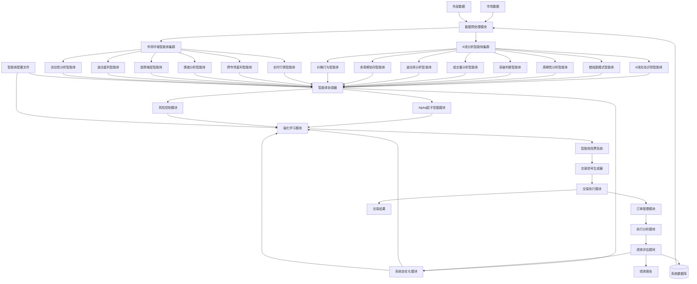
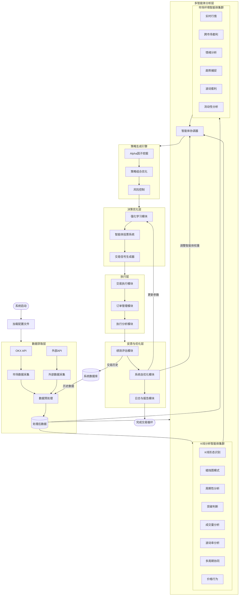
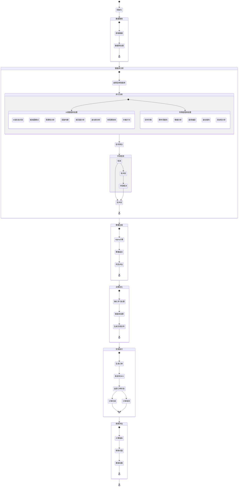
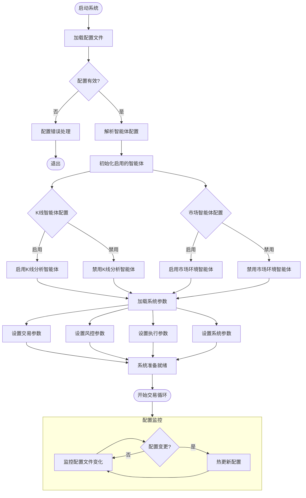
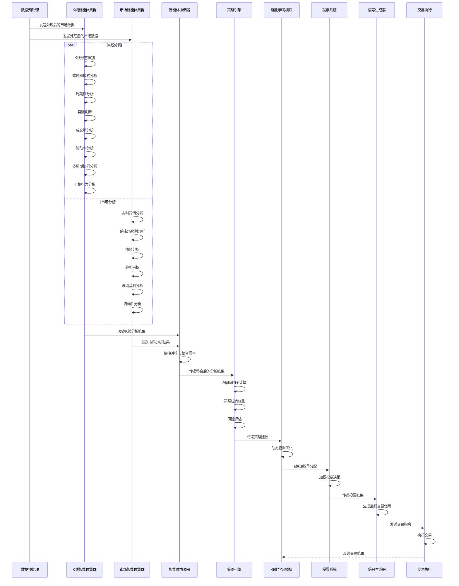
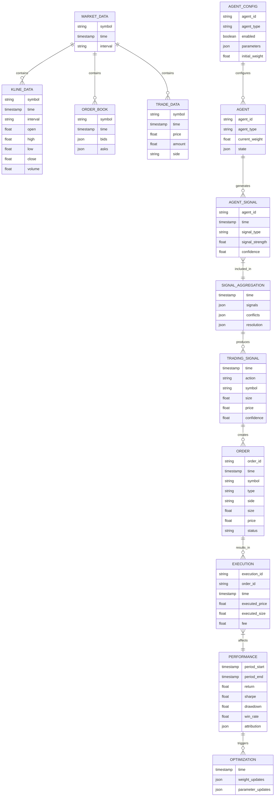

# OKX量化交易系统 - 详细流程图

## 系统总体流程图

## 数据流详细流程图

## 智能体决策流程图

## 配置系统流程图

## 交易信号生成流程图

## 数据库结构图

## 设计理念

本系统流程设计遵循以下核心原则:

1. **模块化**: 每个组件都有明确的职责和接口，便于独立开发和测试
2. **可配置性**: 通过配置文件灵活启用/禁用智能体和调整参数
3. **可扩展性**: 支持添加新的智能体和策略
4. **反馈循环**: 系统持续从交易结果中学习并自我优化
5. **并行处理**: 多智能体并行分析以提高处理效率
6. **冗余设计**: 多种分析视角提供决策冗余，增强系统稳健性
7. **自适应**: 通过强化学习动态调整权重和参数 